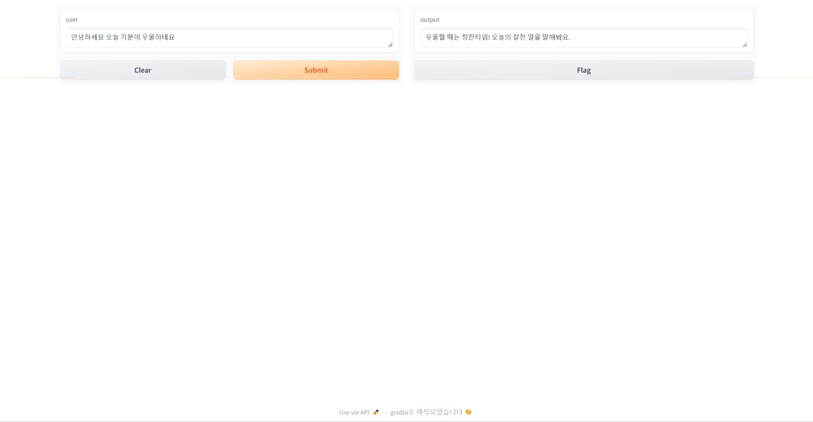

# BERT 실습 - 심리상담 챗봇 제작 
## 제작: 구글 코랩 (임베딩 실습)
  - 라이브러리 설치 
  - 라이브러리 임포트
  - CSV 파일 업로드
  - Ko-SRoBERTa 모델 로드 및 테스트
  - 데이터 로드
  - 데이터 전처리 (불필요한 열 제거)
  - 누락된 값 제거
  - 특정 데이터 확인
  - 첫 번째 문장의 임베딩 생성
  - 데이터셋에 임베딩 열 추가
  - 사용자 입력 문장 임베딩
  - 유사도 계산
  - 가장 유사한 문장 찾기
  - Gradio를 사용 및 실행

  
